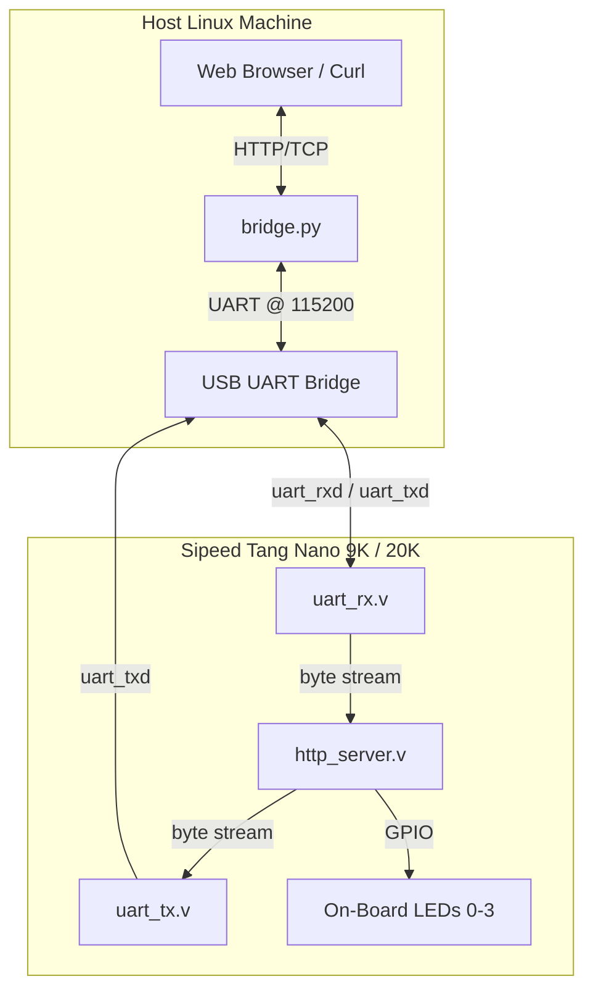

# Hotstate HTTP Web Server Example

A resource-efficient HTTP web server running entirely on a Gowin FPGA as
compiled hotstate microcode (see the [repo-level README](../../README.md)
for what that is). It serves a small glassmorphic LED-control page, handles
a few REST-style routes to toggle on-board LEDs, and returns a JSON status
route for the page to poll — all in a small BRAM footprint (4 of 26 BSRAM
blocks, 15%, on the Tang Nano 9K).

## Architecture & Pipeline



1. **Host bridge**: a lightweight Python TCP-to-UART bridge (`bridge.py`)
   runs on the host, exposing port `8080` to any web browser.
2. **Request reception**: request bytes are forwarded over serial at
   115200 baud to the `uart_rx` hotstate machine on the FPGA.
3. **HTTP parsing**: `http_server` parses the stream, matching routes
   (`GET /`, `GET /01`, `GET /11`, etc.) and the `\r\n\r\n` header
   terminator.
4. **ROM streaming**: static assets (HTML/CSS/JS) stream from const-ROM
   arrays in block RAM, bypassing high-overhead switch-case control logic.
5. **Dynamic state patching**: for the `/s` JSON status route, the server
   intercepts the ROM byte-stream on the fly, patching live LED state into
   the output before it reaches `uart_tx`.

## Source Files

| File | Role |
|------|------|
| `http_server.c` | hotc source: HTTP parser and response streamer. |
| `uart_tx.c` / `uart_rx.c` | hotc source: 115200-baud UART transmit/receive machines. |
| `http_server_template.v`, `uart_tx_template.v`, `uart_rx_template.v` (+ `.mem`/`.vh`/`.toml` siblings) | hotc's compiled output for the three machines above, checked in as-is. |
| `response_streamer.v` | Hand-written Verilog: streams a ROM'd HTTP response, patching in live LED state for `/s`. Carries `(* fsm_encoding = "none" *)` on its `state` register — see `KNOWN_ISSUES.md`. |
| `webserver_top.v` | Hand-written top-level wrapper wiring the three hotstate machines + `response_streamer` to board pins. |
| `webserver_tb.v` | Verilator integration testbench — drives simulated UART traffic for each route and checks responses. |
| `index.html` | The served page: a small glassmorphic LED-toggle dashboard. |
| `generate_response.py` | Plain Python (not hotc) — compiles `index.html`, and three fixed status responses (302/404/201), into the `response_*.h`/`.mem` const-ROM pairs `response_streamer.v` reads. Regenerate with `make generate` after editing `index.html`. |
| `bridge.py` | Host-side TCP-to-UART bridge — the thing that makes `http://localhost:8080` work. |
| `sim_interactive.cpp` | Real-time TCP-to-Verilator bridge — point a browser at a *simulated* server, no board required. `make sim_interactive`. |
| `webserver_tang9k.cst` / `webserver_tang20k.cst` | Pin constraints per board. |
| `Makefile.synth_tang9k` / `Makefile.synth_tang20k` | Per-board synthesis/PNR/pack/program flow. |

## Pin-out

Both boards' pins map directly to on-board features — no external
components or breadboard needed.

### Sipeed Tang Nano 9K (`webserver_tang9k.cst`)
* Clock (27 MHz): pin `52`
* Reset button (S1, active-low): pin `4`
* USB-UART TX (to host): pin `17`; RX (from host): pin `18`
* On-board LEDs (active-low): `led0`=pin `10`, `led1`=pin `11`, `led2`=pin `13`, `led3`=pin `14`
  * The board's user LEDs are a single uniform color, not per-LED
    red/green/blue/yellow — `index.html`'s color-coded labels are a UI
    convention only, not a claim about the physical diode color.

### Sipeed Tang Nano 20K (`webserver_tang20k.cst`)
* Clock (27 MHz): pin `4`
* Reset button (S1, active-low): pin `19`
* USB-UART TX (to host): pin `69`; RX (from host): pin `70`
* On-board LEDs (active-high): `led0`=pin `15`, `led1`=pin `16`, `led2`=pin `17`, `led3`=pin `7`

## Building and running

The `*_template.v`/`.mem`/`.vh`/`.toml` files are hotc's OUTPUT, checked in
as-is — this repo doesn't ship hotc itself, so there's no step to rebuild
those. `response_*.h`/`.mem`, by contrast, come from `generate_response.py`
(plain Python) and do rebuild from `index.html` via `make generate` if you
want to edit the page.

### Simulate (no hardware needed)

```bash
make sim               # scripted integration test over simulated UART
make sim_interactive    # real-time: point a browser at localhost via a
                         # TCP<->Verilator bridge instead of real hardware
```

### Flash real hardware

```bash
make -f Makefile.synth_tang9k prog    # or Makefile.synth_tang20k
```

### Talk to it

```bash
python3 bridge.py --port 8080 --serial-port /dev/ttyUSB1
```
The FPGA's USB-UART bridge chip enumerates as *two* `/dev/ttyUSB*`
devices — one is the JTAG debug interface, the other is the actual UART.
Use `udevadm info -a -n /dev/ttyUSBn | grep interface` to tell them apart
if `/dev/ttyUSB1` isn't right on your machine (interface `00` = JTAG,
interface `01` = UART).

Then open `http://localhost:8080` in a browser — click the toggle
switches to control the real on-board LEDs, or use `curl` directly:

```bash
curl http://localhost:8080/s     # {"led0":0,"led1":0}
curl http://localhost:8080/01    # LED 0 on
curl http://localhost:8080/00    # LED 0 off
curl http://localhost:8080/11    # LED 1 on
curl http://localhost:8080/10    # LED 1 off
```

## Hardware verification

**Tang Nano 9K and Tang Nano 20K: both confirmed working on real
hardware** — every route (`/`, `/s`, `/01`, `/00`, `/11`, `/10`, unmatched
→ 404) verified end to end, including through `bridge.py` with a real
browser (Firefox) issuing full-length requests (~500 bytes with real
headers), not just short hand-crafted test traffic.

See `KNOWN_ISSUES.md` for the GW2A-18C (Tang Nano 20K) yosys `-noalu`
requirement, and the two real bugs found and fixed while bringing this
example up (a yosys FSM-re-encoding issue and a `bridge.py` USB-serial
buffering issue) — worth reading if you hit a similarly silent failure in
a design built the same way.
